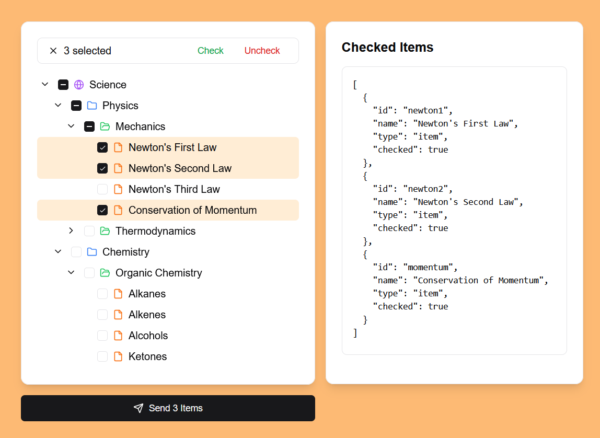

# Shadcn/ui Tree View

A feature-rich tree view component for shadcn/ui with checkboxes, context menus, search, and visual feedback.



## Installation

1. Install dependencies:
```bash
npm install framer-motion @radix-ui/react-context-menu @radix-ui/react-collapsible @radix-ui/react-hover-card
```

2. Install required shadcn/ui components:
```bash
npx shadcn@latest add button
npx shadcn@latest add badge
npx shadcn@latest add input
npx shadcn@latest add context-menu
npx shadcn@latest add collapsible
npx shadcn@latest add hover-card
```

3. Install the tree view component:
```bash
npx shadcn@latest add "https://github.com/neigebaie/shadcn-ui-tree-view/releases/download/v1.1.0/schema.json"
```

## Usage

### TreeViewItem Interface
```tsx
interface TreeViewItem {
  id: string;
  name: string;
  type: string;
  children?: TreeViewItem[];
  checked?: boolean;
}
```

### TreeViewProps Interface
```tsx
interface TreeViewProps {
  className?: string;
  data: TreeViewItem[];
  title?: string;
  showExpandAll?: boolean;
  showCheckboxes?: boolean;
  searchPlaceholder?: string;
  iconMap?: Record<string, React.ReactNode>;
  menuItems?: TreeViewMenuItem[];
  onCheckChange?: (item: TreeViewItem, checked: boolean) => void;
  onAction?: (action: string, items: TreeViewItem[]) => void;
}

interface TreeViewMenuItem {
  id: string;
  label: string;
  icon?: React.ReactNode;
  action: (items: TreeViewItem[]) => void;
}
```

## Example

```tsx
import { TreeView } from "@/components/tree-view";
import { Globe, Folder, FolderOpen, File } from "lucide-react";

const data = [
  {
    id: "1",
    name: "Root",
    type: "region",
    children: [
      {
        id: "1.1",
        name: "Folder 1",
        type: "store",
        children: [
          {
            id: "1.1.1",
            name: "Subfolder",
            type: "department",
            children: [
              { id: "1.1.1.1", name: "File 1", type: "item" },
              { id: "1.1.1.2", name: "File 2", type: "item" },
            ],
          },
        ],
      },
    ],
  },
];

const customIconMap = {
  region: <Globe className="h-4 w-4 text-purple-500" />,
  store: <Folder className="h-4 w-4 text-blue-500" />,
  department: <FolderOpen className="h-4 w-4 text-green-500" />,
  item: <File className="h-4 w-4 text-orange-500" />,
};

const menuItems = [
  {
    id: "download",
    label: "Download",
    icon: <Download className="h-4 w-4" />,
    action: (items) => console.log("Downloading:", items),
  },
];

export default function Demo() {
  const handleCheckChange = (item: TreeViewItem, checked: boolean) => {
    console.log(`Item ${item.name} checked:`, checked);
  };

  return (
    <TreeView
      data={data}
      title="Tree View Demo"
      showCheckboxes={true}
      iconMap={customIconMap}
      menuItems={menuItems}
      onCheckChange={handleCheckChange}
    />
  );
}
```

## Features

- [x] Search functionality
- [X] Selection capabilities (single click, range, multi-select, drag select)
- [X] Folder management system with expand/collapse and item counting for collapsed folders
- [X] Visual feedback system with animations and level-specific icons
- [X] Context menu with file/folder specific actions

## License

Licensed under the MIT License. See the [LICENSE](LICENSE) file for more details.
